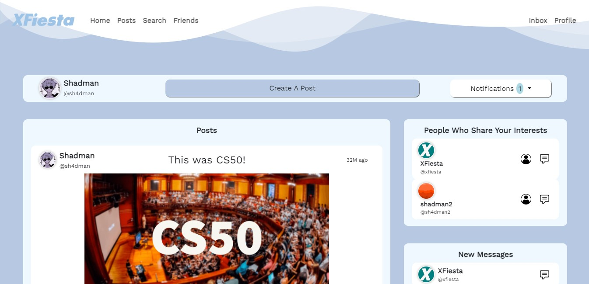

# XFiesta
A web-based social media platform

By Shadman Shahab

## Table of Contents
- [Description](#description)
- [Installation and Dependencies](#installation-and-dependencies)
- [Features](#features)
- [Project Files](#project-files)
- [Video Demonstration](#video-demonstration)

## Description


XFiesta is my final project for [CS50x](https://cs50.edx.org/). It is my attempt at creating a simple and minimalistic yet functional web-based social media platform, using Python's Flask module. As of now, XFiesta has various features like user profiling, a friend system, chat functionality, creating posts, post comments, post and comment interactions etc.

The application uses Python and Flask to handle all server-sided functionality and utilizes SQLite3 for database management. For real-time features such as chats and notifications, the current implementation relies on periodic AJAX requests to query the server for updates. WebSocket has not been integrated into this project.

## Installation and Dependencies
To run this application, first clone this repository on your device via either of the following commands:
```
git clone https://github.com/sh4dman23/XFiesta.git
git clone git@github.com:sh4dman23/XFiesta.git
```
If you do not have python, pip or sqlite3 installed on your device, run:
```
sudo apt update
sudo apt install python3
sudo apt install pip
sudo apt install sqlite3
```
All python packages that need to be installed to run the program smoothly are mentioned in [requirements.txt](requirements.txt), which can be installed via:
```
pip install -r requirements.txt
```
The application can be run via:
```
flask run
```

## Features
<ul>
    <li><a href="#user-profiling">User Profiling</a></li>
    <li><a href="#friends">Friends</a></li>
    <li><a href="#posts-and-comments">Posts and Comments</a></li>
    <li><a href="#inbox-and-chatting">Inbox and Chatting</a></li>
    <li><a href="#search">Search</a></li>
</ul>

### User Profiling


In XFiesta, users are mainly identified by their username, which is unique for every user. Besides a username, every user has a name, an about me (which shows default value on the profile page, if the user chooses to keep it empty), a profile picture and interests. Interests have a core functionality in XFiesta, as the user's feed personalization, as well as friend recommendations are done based on their interests. Interests are fixed and users are able to add and remove interests from their profile. While users have the option to leave their "About Me" and "Interests" sections empty, we encourage them to provide information in these fields. Doing so enhances the personalization experience and helps connect users with like-minded individuals. Users also have a "carnival points" count which works similar to "karma" in reddit.

### Friends


XFiesta has been designed to facilitate connections and strengthen relationships between people. The platform empowers users with the ability to:

- #### Send Friend Requests:
    Users can easily discover and connect with others by sending friend requests. This initial step allows members to express their interest in establishing a connection.

- #### Accept or Decline Friend Requests:
    Upon receiving a friend request, users have the option to either accept or decline it. This ensures that users maintain control over their network and can choose who they wish to connect with.

- #### Manage Friends List:
    Users can efficiently manage their list of friends. They can add new friends by accepting requests, and they also have the flexibility to remove friends from their list if they wish to do so. Moreover, users will also recieve friend recommendations for people with similar interests.

Users will receive notifications and updates from their friends' activities, enhancing their real-time connection within the social network. Friends also play a significant role in personalizing and diversifying the user's feed, making it a more engaging experience.

### Posts and Comments
| Posts page                                   | Post                                         |
| -------------------------------------------- | -------------------------------------------- |
|             |               |

 XFiesta empowers users to create and share posts, as well as edit and delete their own posts. These posts serve as a medium for users to express themselves, share updates, and engage with their network. For the sake of simplicity, XFiesta limits each post to a maximum of one image. Users can interact with posts through likes, dislikes and comments. Likes and dislikes on posts user's impact carnival points. Users can see all of their own posts as well as their friends' in the post page.


 Users are able to add comments to posts as well as interact with them. Likes and dislikes on comments also impact user's carnival points.

 ### Inbox and Chatting
 

Social interactions being the main focus of XFiesta, users are easily able to instantly chat with friends and keep track of open chats as well. Chatting functionality in XFiesta has been kept relatively simple and does not support file sharing, as of now.


For messsages, I have used a simple AJAX script that queries the server to check for new messages (every 700ms) and deleted messages (every 1500ms) and then adjusts the users' interface accordingly.

### Notifications


Notifications sent to users are stored in the database, and can be seen by the user in the notifications page. Some notifications however get removed depending on it's cause. For example, if a user sent a friend request to another user and then canceled that request, that notification would be automatically removed.


Additionally, unread notifications also show up in the homepage and the website will check for new notifications every 5 seconds to provide the latest notifications to the user while in the homepage.

### Search


I have also included a search functionality in XFiesta. It sends the user's query to the server and displays results returned via querying the database. The search results are sorted according to post title when searching for posts, and by username and then name when searching for users.

Additionally, for the sake of simplicity, every user's name is limited to 70 characters while their about me, posts, comments and messages (in chat) are limited to 640 characters each.

## Project Files
- ### Main Files:
    [app.py](app.py) contains the main code for running the web application on the server. [helpers.py](helpers.py) provides 2 functions and 1 decorator which are frequently used to run the app.

- ### Database:
    [xfiesta.db](xfiesta.db) stores all site data in a database, which is a core part of the functionality of XFiesta. [database_schema.sql](database_schema.sql) provides the structure of tables and indexes on necessary columns of the tables in the database, which is used to run a script that ensures all required tables and indexes are present in the database on server initialization.

- ### Requirements:
    [requirements.txt](requirements.txt) contains all python packages required to run this application.

- ### Templates:
    The [templates](/templates) directory contains the templates for the HTML for all pages on this web application. Jinja was used for templating, that comes alongside flask.

- ### Static:
    The [static](/static) directory contains all static images (in [images](/static/images)), CSS (in [styles](/static/styles)) and JavaScript (in [scripts](/static/scripts)) files.

- ### Server Hosted Files:
    XFiesta hosts the user uploaded files in the server within the [server_hosted_files](/server_hosted_files) directory.

## Video Demonstration
A video demonstration of the project can be found on [YouTube](https://youtu.be/NTNGm2FfoQc)


#### I am Shadman Shahab, and this was CS50!
